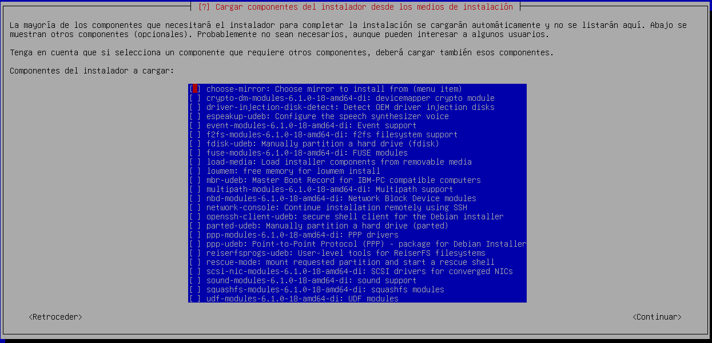

# Systemd-Boot

## Enunciado

Los desarrolladores de Debian han propuesto el uso de systemd-boot para instalaciones UEFI de Debian Trixie, que se lanzará en 2025. Opción disponible, de momento, en instalaciones debian 13 en modo experto. El objetivo es agregar soporte de arranque seguro firmado a Debian para intentar resolver el problema relacionado con UEFI y Secure Boot con sistemas Debian. Proponen utilizar un gestor de arranque llamado “systemd-boot” para mejorar el proceso de arranque de Debian en sistemas UEFI.

1. Instala en máquina virtual, debian 13 con systemd-boot, y familiarízate con este nuevo gestor de arranque.
2. Cambiar el tradicional gestor de arranque grub por systemd boot en una máquina virtual con debian 12.

```
• Valora las ventajas y desventajas de este cambio.
    • Indica que versiones basadas en GNU/Linux están adoptando a systemd-boot como gestor de arranque por defecto.
```

```
• En máquina virtual basada en Debian 12, sustituye el gestor de arranque grub por systemd-boot, en el menú de arranque deberá aparecer las siguientes opciones:
Arranque de debian 12.
    Acceso a Firmware de la máquina virtual.
    Acceso a la shel EFI.
```

# Ejercicio1 → Instala en máquina virtual, debian 13 con systemd-boot, y familiarízate con este nuevo gestor de arranque.

En esta parte del texto, vamos a ver cómo instalar Debian 13 (Trixie) usando el gestor de arranque systemd-boot en un sistema que funcione con UEFI.
Primero, hay que descargar la imagen ISO de Debian 13 Trixie desde la página oficial de Debian. Ahí elegiremos la versión que más nos sirva; en mi caso, optaré por la versión netinst.
Para la instalación, vamos a usar QEMU/KVM como herramienta de virtualización para crear una máquina virtual. Es importante asegurarse de que UEFI esté bien configurado antes de empezar, ya que Debian 13 arranca en este modo y usa systemd-boot como gestor de arranque.


Para garantizar que systemd-boot se instale de forma correcta en Debian 13, es necesario optar por la instalación en modo experto. Esto nos dará la posibilidad de seleccionar manualmente el gestor de arranque y ajustar configuraciones avanzadas.
En vez de escoger la opción estándar Install, debemos ir a Advanced options y después seleccionar Expert install.


Después de seleccionar esta opción, continuamos con la instalación. El primer paso será escoger el idioma:


Mientras llevamos a cabo la instalación en modo experto de Debian 13, es posible que el instalador nos presente la opción “Detectar y montar el medio de instalación”. Esta función resulta muy útil cuando estamos instalando desde la red o utilizando un medio externo, como un USB o una imagen ISO montada, en lugar del disco duro local. En este caso, simplemente seleccionamos la opción que el instalador nos detecte automáticamente.


A continuación, el instalador nos mostrará una lista de componentes opcionales que podemos descargar si los necesitamos. En mi caso, no he seleccionado ninguno, ya que para el propósito de esta práctica no serán necesarios.




Después, el instalador nos preguntará cómo queremos configurar la red. En este paso, seleccionamos la opción de configuración automática.


Una vez hecho esto, continuamos con la instalación como de costumbre. Sin embargo, cuando lleguemos al paso del particionado de discos, debemos detenernos.
El particionado del disco es una de las fases más importantes durante la instalación de Debian, especialmente al configurar un sistema con UEFI. Al llegar a esta etapa, es fundamental definir correctamente las particiones para asegurar que Debian se instale de forma adecuada y que systemd-boot funcione como gestor de arranque.
Por esta razón, debemos optar por el particionado manual, ya que nos da control total sobre cómo se organizará el disco.
Luego, seleccionamos el disco en el que realizaremos el particionado; en este caso, solo tenemos uno disponible.


El instalador nos preguntará si queremos particionar el disco, a lo que responderemos que “Sí”. Después, nos ofrecerá la opción de elegir el tipo de tabla de particiones que vamos a usar. En este caso, seleccionamos GPT (Tabla de Particiones GUID), ya que es la más adecuada para sistemas UEFI.


Ahora, debemos realizar el particionado, el cual yo haré de la siguiente forma:
Partición EFI: 
Tipo: EFI System Partition 
Tamaño recomendado: 100 MB
Punto de montaje: /boot/efi 
Esta partición es crucial para UEFI, ya que contiene los archivos del cargador de arranque, como systemd-boot. 
Partición raíz (/): 
Tipo: ext4 
Tamaño recomendado: 21 GB
Punto de montaje: / 
Esta partición contendrá el sistema operativo y todos los archivos de configuración. 
Área de intercambio (swap): 
Tipo: Linux swap 
Tamaño recomendado: el tamaño será el restante, en este caso 374eMB. 
Esta partición es utilizada como espacio de intercambio cuando la RAM se llena. 
De forma que el particionado quedaría de la siguiente forma:


Una vez que hayamos creado y ajustado las particiones, el instalador nos pedirá que confirmemos el esquema de particionado. Si todo está correcto, seleccionamos “Sí” para aplicar los cambios. Esto procederá a formatear el disco y a crear las particiones que configuramos.
Con el particionado completo, el siguiente paso es instalar el sistema base. Durante este proceso, el instalador nos ofrecerá la opción de elegir qué núcleo (kernel) queremos utilizar. En mi caso, opté por la segunda opción.


A continuación, el instalador nos pedirá que seleccionemos una opción para los controladores. En este caso, elegiré "dirigido", ya que para esta práctica no es necesario cargar demasiados controladores.


Cuando lleguemos a la parte del proceso de instalación en la que el instalador pregunta si queremos analizar medios de instalación adicionales, debemos seleccionar “No”.
Esta opción le permitiría al instalador buscar e instalar paquetes adicionales desde otros medios (como discos o dispositivos USB que contengan paquetes de instalación). Sin embargo, en la mayoría de los casos, no es necesario añadir más medios de instalación si ya estamos usando una imagen ISO completa o realizando una instalación a través de la red.


