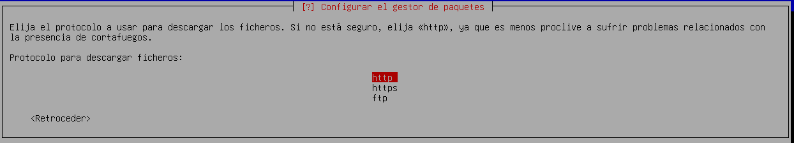

# Systemd-Boot

## Enunciado

Los desarrolladores de Debian han propuesto el uso de systemd-boot para instalaciones UEFI de Debian Trixie, que se lanzará en 2025. Opción disponible, de momento, en instalaciones debian 13 en modo experto. El objetivo es agregar soporte de arranque seguro firmado a Debian para intentar resolver el problema relacionado con UEFI y Secure Boot con sistemas Debian. Proponen utilizar un gestor de arranque llamado “systemd-boot” para mejorar el proceso de arranque de Debian en sistemas UEFI.

1. Instala en máquina virtual, debian 13 con systemd-boot, y familiarízate con este nuevo gestor de arranque.
2. Cambiar el tradicional gestor de arranque grub por systemd boot en una máquina virtual con debian 12.

```
• Valora las ventajas y desventajas de este cambio.
    • Indica que versiones basadas en GNU/Linux están adoptando a systemd-boot como gestor de arranque por defecto.
```

```
• En máquina virtual basada en Debian 12, sustituye el gestor de arranque grub por systemd-boot, en el menú de arranque deberá aparecer las siguientes opciones:
Arranque de debian 12.
    Acceso a Firmware de la máquina virtual.
    Acceso a la shel EFI.
```

# Ejercicio1 → Instala en máquina virtual, debian 13 con systemd-boot, y familiarízate con este nuevo gestor de arranque.

En esta parte del texto, vamos a ver cómo instalar Debian 13 (Trixie) usando el gestor de arranque systemd-boot en un sistema que funcione con UEFI.
Primero, hay que descargar la imagen ISO de Debian 13 Trixie desde la página oficial de Debian. Ahí elegiremos la versión que más nos sirva; en mi caso, optaré por la versión netinst.
Para la instalación, vamos a usar QEMU/KVM como herramienta de virtualización para crear una máquina virtual. Es importante asegurarse de que UEFI esté bien configurado antes de empezar, ya que Debian 13 arranca en este modo y usa systemd-boot como gestor de arranque.


Para garantizar que systemd-boot se instale de forma correcta en Debian 13, es necesario optar por la instalación en modo experto. Esto nos dará la posibilidad de seleccionar manualmente el gestor de arranque y ajustar configuraciones avanzadas.
En vez de escoger la opción estándar Install, debemos ir a Advanced options y después seleccionar Expert install.


Después de seleccionar esta opción, continuamos con la instalación. El primer paso será escoger el idioma:


Mientras llevamos a cabo la instalación en modo experto de Debian 13, es posible que el instalador nos presente la opción “Detectar y montar el medio de instalación”. Esta función resulta muy útil cuando estamos instalando desde la red o utilizando un medio externo, como un USB o una imagen ISO montada, en lugar del disco duro local. En este caso, simplemente seleccionamos la opción que el instalador nos detecte automáticamente.


A continuación, el instalador nos mostrará una lista de componentes opcionales que podemos descargar si los necesitamos. En mi caso, no he seleccionado ninguno, ya que para el propósito de esta práctica no serán necesarios.


Después, el instalador nos preguntará cómo queremos configurar la red. En este paso, seleccionamos la opción de configuración automática.


Una vez hecho esto, continuamos con la instalación como de costumbre. Sin embargo, cuando lleguemos al paso del particionado de discos, debemos detenernos.
El particionado del disco es una de las fases más importantes durante la instalación de Debian, especialmente al configurar un sistema con UEFI. Al llegar a esta etapa, es fundamental definir correctamente las particiones para asegurar que Debian se instale de forma adecuada y que systemd-boot funcione como gestor de arranque.
Por esta razón, debemos optar por el particionado manual, ya que nos da control total sobre cómo se organizará el disco.
Luego, seleccionamos el disco en el que realizaremos el particionado; en este caso, solo tenemos uno disponible.


El instalador nos preguntará si queremos particionar el disco, a lo que responderemos que “Sí”. Después, nos ofrecerá la opción de elegir el tipo de tabla de particiones que vamos a usar. En este caso, seleccionamos GPT (Tabla de Particiones GUID), ya que es la más adecuada para sistemas UEFI.


Ahora, debemos realizar el particionado, el cual yo haré de la siguiente forma:
Partición EFI: 
Tipo: EFI System Partition 
Tamaño recomendado: 100 MB
Punto de montaje: /boot/efi 
Esta partición es crucial para UEFI, ya que contiene los archivos del cargador de arranque, como systemd-boot. 
Partición raíz (/): 
Tipo: ext4 
Tamaño recomendado: 21 GB
Punto de montaje: / 
Esta partición contendrá el sistema operativo y todos los archivos de configuración. 
Área de intercambio (swap): 
Tipo: Linux swap 
Tamaño recomendado: el tamaño será el restante, en este caso 374eMB. 
Esta partición es utilizada como espacio de intercambio cuando la RAM se llena. 
De forma que el particionado quedaría de la siguiente forma:


Una vez que hayamos creado y ajustado las particiones, el instalador nos pedirá que confirmemos el esquema de particionado. Si todo está correcto, seleccionamos “Sí” para aplicar los cambios. Esto procederá a formatear el disco y a crear las particiones que configuramos.
Con el particionado completo, el siguiente paso es instalar el sistema base. Durante este proceso, el instalador nos ofrecerá la opción de elegir qué núcleo (kernel) queremos utilizar. En mi caso, opté por la segunda opción.


A continuación, el instalador nos pedirá que seleccionemos una opción para los controladores. En este caso, elegiré "dirigido", ya que para esta práctica no es necesario cargar demasiados controladores.


Cuando lleguemos a la parte del proceso de instalación en la que el instalador pregunta si queremos analizar medios de instalación adicionales, debemos seleccionar “No”.
Esta opción le permitiría al instalador buscar e instalar paquetes adicionales desde otros medios (como discos o dispositivos USB que contengan paquetes de instalación). Sin embargo, en la mayoría de los casos, no es necesario añadir más medios de instalación si ya estamos usando una imagen ISO completa o realizando una instalación a través de la red.


Cuando lleguemos a la opción de “¿Desea utilizar una réplica en red?” durante la instalación, es importante seleccionar “Sí”.


En este paso, el instalador nos da la opción de utilizar una réplica en red (mirror) para obtener paquetes adicionales y actualizaciones durante la instalación. Dado que estamos usando una imagen de instalación mínima (netinst), el sistema base que se instalará será bastante reducido. Al seleccionar “Sí”, podremos acceder a una réplica en red que proporcionará los paquetes necesarios para completar la instalación y actualizar el sistema.
Esto permitirá que se descargue software adicional e instale los paquetes necesarios para tener un sistema Debian completamente funcional.
Luego, seleccionamos HTTP como el protocolo para acceder a la réplica en red.



En esta parte del proceso de instalación, el instalador nos preguntará si queremos usar firmware no libre para asegurar el funcionamiento de ciertos componentes de hardware, como tarjetas Wi-Fi, chipsets de audio, etc.
El firmware no libre es necesario para que algunos dispositivos funcionen correctamente, pero no es software libre. A pesar de ello, Debian ofrece estos firmwares para asegurar la compatibilidad con una amplia gama de hardware, aunque las licencias de estos firmwares limitan la libertad para usar, modificar o compartir el software.
Seleccionar “Sí” en esta opción permitirá al instalador cargar y utilizar los firmwares no libres que puedan ser necesarios para que tu hardware funcione de forma adecuada, sobre todo si estás utilizando hardware específico que requiere controladores no libres.


En esta etapa, el instalador nos preguntará si queremos habilitar ciertos servicios de actualización para nuestro sistema Debian. Debian ofrece dos servicios principales relacionados con las actualizaciones:
    • Actualizaciones de seguridad: Estas actualizaciones son esenciales para proteger el sistema contra vulnerabilidades de seguridad. Debian recomienda encarecidamente habilitar este servicio para recibir actualizaciones que solucionen fallos de seguridad potenciales.
    • Actualizaciones de la distribución: Este servicio proporciona versiones más recientes de los paquetes del sistema con cambios importantes. Mantener esta opción habilitada asegura que el sistema se mantenga actualizado con las últimas versiones estables de los paquetes.
    • Programas migrados a nuevas versiones (opcional): Esta opción da acceso a programas más recientes que están en desarrollo o que se han actualizado a nuevas versiones. Sin embargo, estos paquetes pueden no ser tan estables, ya que no han sido completamente probados, aunque ofrecen nuevas características.
Por lo tanto, dejaremos marcadas las dos primeras opciones que vienen por defecto.


En esta sección, el instalador nos preguntará si queremos habilitar las actualizaciones automáticas. Aunque esta opción puede ser útil, para el propósito de esta práctica, seleccionaremos “No”.


En la selección de programas elegiremos a nuestro gusto:


Después de varios minutos en los que el instalador descarga e instala los paquetes del sistema, llegamos a uno de los pasos más importantes de la instalación: la selección del cargador de arranque.
El cargador de arranque es un software esencial que permite arrancar el sistema operativo cuando se enciende el equipo. Por lo general, Debian utiliza GRUB como su gestor de arranque predeterminado, pero en esta instalación estamos configurando systemd-boot, un gestor de arranque más ligero y moderno, diseñado especialmente para sistemas UEFI.


Después de completar la instalación del sistema y llegar al momento del reinicio, es necesario desactivar el Secure Boot en el firmware UEFI para que el cargador de arranque systemd-boot funcione correctamente.
¿Por qué desactivar Secure Boot?
El Secure Boot es una característica de UEFI diseñada para prevenir que se cargue software no firmado o malicioso al arrancar el sistema. Sin embargo, en algunos casos, como al instalar Debian con systemd-boot, el firmware puede bloquear el arranque si el sistema operativo no está firmado digitalmente o no es compatible con Secure Boot.
Systemd-boot es un gestor de arranque que no siempre es compatible con Secure Boot por defecto, por lo que es necesario desactivarlo para permitir que el sistema se inicie correctamente.


Para desactivarlo, seguimos los pasos que se indican en las siguientes capturas:


Reiniciamos la maquina y comprobamos:


Y nos dirigimos hacia la terminal y ejecutamos el siguiente comando:

```
su -
bootctl status
```


bootctl es una herramienta integrada en systemd que permite gestionar systemd-boot. El subcomando status muestra información sobre el estado actual del gestor de arranque.
Como podemos observar en la imagen, systemd-boot está instalado y configurado correctamente.

# Ejercicio2. Cambiar el tradicional gestor de arranque grub por systemd boot en una máquina virtual con debian 12.

## Análisis Comparativo: Systemd-boot y GRUB

## Systemd-boot
Ventajas:
    1. Diseño Minimalista y Eficiente:
Systemd-boot se destaca por su enfoque simple y liviano. Su estructura minimalista permite un uso optimizado de los recursos y arranques más veloces en comparación con opciones más robustas como GRUB.
    2. Integración Completa con Systemd:
Diseñado para funcionar de manera conjunta con systemd, este gestor facilita la administración de sistemas que ya utilizan systemd como su núcleo de inicialización.
    3. Arranques Ágiles:
Gracias a su simplicidad, systemd-boot suele ofrecer tiempos de arranque reducidos, ideal para quienes buscan un inicio rápido del sistema.

Desventajas:
    1. Opciones Limitadas:
La naturaleza simplificada de systemd-boot implica una menor flexibilidad. Carece de características avanzadas que sí ofrece GRUB y solo es compatible con sistemas EFI, lo que restringe su utilidad en ciertos entornos.
    2. Gestión Compleja de Sistemas Múltiples:
A diferencia de GRUB, systemd-boot requiere más trabajo manual para configurar un menú de arranque que soporte múltiples sistemas operativos, lo que puede ser un desafío en configuraciones duales o más complejas.

## GRUB

Ventajas:
    1. Versatilidad en Configuraciones Multisistema:
GRUB sobresale al permitir una administración eficiente de múltiples sistemas operativos desde un único menú de arranque, una funcionalidad clave para usuarios con configuraciones duales o avanzadas.
    2. Altamente Personalizable:
Con un amplio rango de opciones avanzadas, GRUB brinda la posibilidad de ajustar y personalizar cada aspecto del proceso de arranque, resultando ideal para quienes buscan control absoluto.


Desventajas:
    1. Complejidad para Principiantes:
La riqueza de opciones y configuraciones en GRUB puede ser abrumadora para usuarios sin experiencia, ya que manejar su configuración suele requerir edición manual de archivos.
    2. Arranques Más Lentos:
El diseño robusto de GRUB puede llevar a tiempos de arranque más prolongados en comparación con gestores más ligeros como systemd-boot.

Indica que versiones basadas en GNU/Linux están adoptando a systemd-boot como gestor de arranque por defecto.

En mayo de 2011, Fedora pasó a ser la primera distribución destacada de Linux en activar systemd como configuración predeterminada.
Distribuciones que tienen systemd activado por defecto:
Arch Linux, Clear Linux, Pop!_OS, Fedora y Antergos.

# Ejercicio3: En máquina virtual basada en Debian 12, sustituye el gestor de arranque grub por systemd-boot, en el menú de arranque deberá aparecer las siguientes opciones:

## Arranque de debian 12.
## Acceso a Firmware de la máquina virtual.
## Acceso a la shel EFI.


Usaremos una máquina con el sistema Debian 12 instalado y con GRUB como gestor de arranque:


La máquina en cuestión presentará el siguiente esquema de particionado:

```
usuario@debian:~$ lsblk -f
NAME   FSTYPE FSVER LABEL UUID                                 FSAVAIL FSUSE% MOUNTPOINTS
sr0                                                                           
vda                                                                           
├─vda1 vfat   FAT32       6525-58B7                             505,1M     1% /boot/efi
├─vda2 ext4   1.0         9379ede6-d81c-4e39-b64b-f45d20b9161b   16,6G    22% /
└─vda3 swap   1           248d5853-d0aa-4421-927e-0bde999d73f1                [SWAP]
```

Como podemos comprobar,el sistema ha arrancado mediante grub, ya que tiene su partición correspondiente /boot/efi. Para hacer la instalación de SystemdBoot es importante que la partición de arranque se encuentre en formato vfat, ya que SystemdBoot no reconoce otro sistema de de ficheros.
Empezaremos instalando el paquete que contiene todos los binarios que usaremos para el cambio:

```
usuario@debian:~$ sudo apt install systemd-boot
[sudo] contraseña para usuario: 
Leyendo lista de paquetes... Hecho
Creando árbol de dependencias... Hecho
Leyendo la información de estado... Hecho
```

Por defecto, en un sistema con UEFI (Unified Extensible Firmware Interface), la partición de arranque EFI (/boot/efi) ya debería estar formateada en FAT32. Esto se debe a que el sistema UEFI utiliza este formato para almacenar los cargadores de arranque (como systemd-boot o GRUB) y otros archivos necesarios para el arranque del sistema.
Pero por error durante la instalación, he tenido que modificar el formato de la partición de la siguiente forma:

```
usuario@debian:~$ sudo gdisk /dev/vda
Command (? for help): t
Partition number (1-3): 1
Current type is EF00 (EFI system partition)
Hex code or GUID (L to show codes, Enter = EF00): EF00
Changed type of partition to 'EFI system partition'

Command (? for help): w

Final checks complete. About to write GPT data. THIS WILL OVERWRITE EXISTING
PARTITIONS!!

Do you want to proceed? (Y/N): y
OK; writing new GUID partition table (GPT) to /dev/vda.
Warning: The kernel is still using the old partition table.
The new table will be used at the next reboot or after you
run partprobe(8) or kpartx(8)
The operation has completed successfully.
```

Usaremos el siguiente comando para instalar el cargador de arranque:

```
usuario@debian:~$ sudo bootctl --path=/boot/efi install
Copied "/usr/lib/systemd/boot/efi/systemd-bootx64.efi" to "/boot/efi/EFI/systemd/systemd-bootx64.efi".
Copied "/usr/lib/systemd/boot/efi/systemd-bootx64.efi" to "/boot/efi/EFI/BOOT/BOOTX64.EFI".
Random seed file /boot/efi/loader/random-seed successfully written (32 bytes).
Not installing system token, since we are running in a virtualized environment.
Created EFI boot entry "Linux Boot Manager".
```

Para comprobar que se han creado los archivos y directorios correspondientes, usaremos el siguiente comando:

```
root@debian:/home/usuario# ls -l /boot/efi/loader/
total 16
drwx------ 2 root root 4096 may 21 11:24 entries
-rwx------ 1 root root    6 may 21 11:23 entries.srel
-rwx------ 1 root root   73 may 21 11:23 loader.conf
-rwx------ 1 root root   32 may 21 11:25 random-seed
```

Instalamos el cargador de inicialización de systemd-boot:

```
usuario@debian:~$ sudo bootctl install
Copied "/usr/lib/systemd/boot/efi/systemd-bootx64.efi" to "/boot/efi/EFI/systemd/systemd-bootx64.efi".
Copied "/usr/lib/systemd/boot/efi/systemd-bootx64.efi" to "/boot/efi/EFI/BOOT/BOOTX64.EFI".
Random seed file /boot/efi/loader/random-seed successfully written (32 bytes).
Not installing system token, since we are running in a virtualized environment.
Created EFI boot entry "Linux Boot Manager".
```

Tras esto, editaremos el fichero loader.conf para configurar las opciones de arranque:

```
root@debian:/home/usuario# sudo cat /boot/efi/loader/loader.conf 
timeout 3
console-mode keep
editor yes
default debian.conf
```

Crearemos un fichero de configuración llamado debian.conf

```
root@debian:/boot# cat /boot/efi/loader/entries/debian.conf
title Sysytemd-boot Alejandro
linux /boot/vmlinuz-6.1.0-35-amd64
initrd /boot/initrd.img-6.1.0-35-amd64
options root=UUID=9379ede6-d81c-4e39-b64b-f45d20b9161b rw
```

En este, hemos especificado el kernel que vamos a iniciar, la imagen initrd y el UUID de ña partición raíz que se montará (podemos visualizarla con el comando blkid).

Creamos otro fichero para la Shell EFI:

```
root@debian:~# sudo cat /boot/efi/loader/entries/shellefi.conf
title EFI Shell
efi /EFI/shellx64.efi
```

Descargamos el firmware necesario:

```
usuario@debian:~$ wget https://github.com/holoto/efi_shell_flash_bios/blob/master/Shellx64.efi
--2025-05-21 11:32:36--  https://github.com/holoto/efi_shell_flash_bios/blob/master/Shellx64.efi
Resolviendo github.com (github.com)... 140.82.121.4
Conectando con github.com (github.com)[140.82.121.4]:443... conectado.
Petición HTTP enviada, esperando respuesta... 200 OK
Longitud: no especificado [text/html]
Grabando a: «Shellx64.efi»

Shellx64.efi                  [ <=>                                  ] 173,70K  --.-KB/s    en 0,1s    

2025-05-21 11:32:36 (1,44 MB/s) - «Shellx64.efi» guardado [177872]
```

Lo movemos a la ruta que especificamos anteriormente:

```
root@debian:/home/usuario# mv Shellx64.efi /boot/efi/EFI/
```

Podemos ver que se ha incorporado correctamente al directorio deseado con el siguiente comando:

```
root@debian:/boot/efi/EFI# ls -l
total 192
drwx------ 2 root root   4096 may 21 11:27 BOOT
drwx------ 2 root root   4096 may 21 11:14 debian
drwx------ 2 root root   4096 may 21 11:23 Linux
-rwx------ 1 root root 177872 may 21 11:32 Shellx64.efi
drwx------ 2 root root   4096 may 21 11:27 systemd
```

Desactivamos el Secure Boot, ya que, como comentamos en el ejercicio anterior, este es incompatible con el nuevo gestor de arranque:

```
usuario@debian:~$ sudo mokutil --disable-validation
password length: 8~16
input password: 
input password again: 
```

Actualizamos el gestor de arranque:
```
usuario@debian:~$ sudo bootctl update
Skipping "/boot/efi/EFI/systemd/systemd-bootx64.efi", since same boot loader version in place already.
Skipping "/boot/efi/EFI/BOOT/BOOTX64.EFI", since same boot loader version in place already.
```

Comprobamos el orden de arranque con la herramienta efibootmgr:
```
usuario@debian:~$ efibootmgr
BootCurrent: 0004
Timeout: 0 seconds
BootOrder: 0001,0004,0002,0000,0003
Boot0000* UiApp
Boot0001* Linux Boot Manager
Boot0002* UEFI Misc Device
Boot0003* EFI Internal Shell
Boot0004* debian
```

Como el gestor que queremos utilizar está marcado con el ID 0001, usaremos el siguiente comando para que se use correctamente :

```
usuario@debian:~$ sudo efibootmgr -o 0001
```

Tras efectuar un reinicio del sistema, podremos comprobar que el gestor ha cargado correctamente:


Si accedemos al sistema, podremos comprobar que, el gestor de arranque es el correcto:


También podremos acceder a la Shell EFI sin ningún problema:

