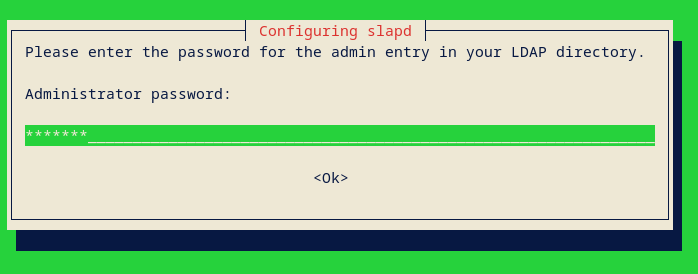
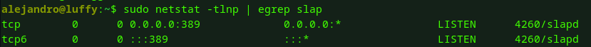
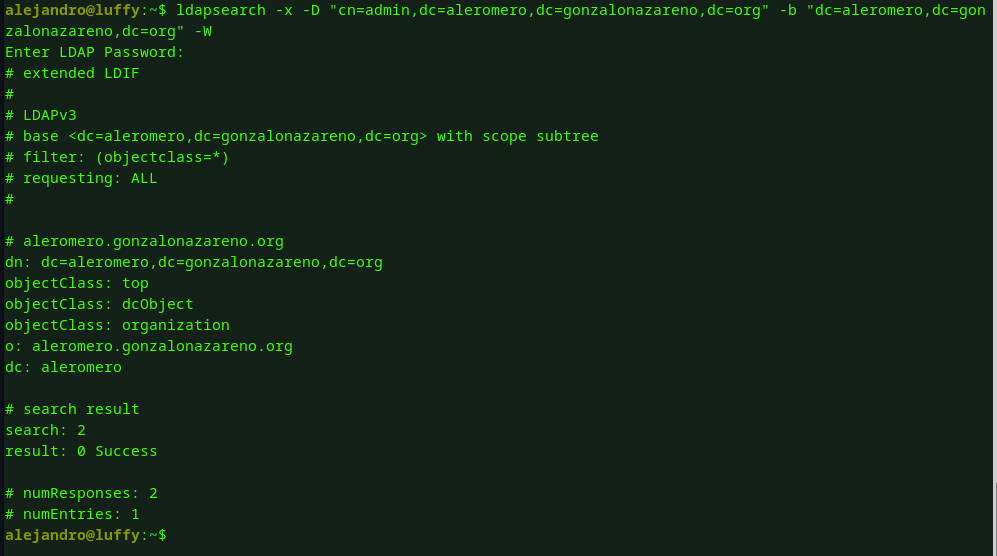
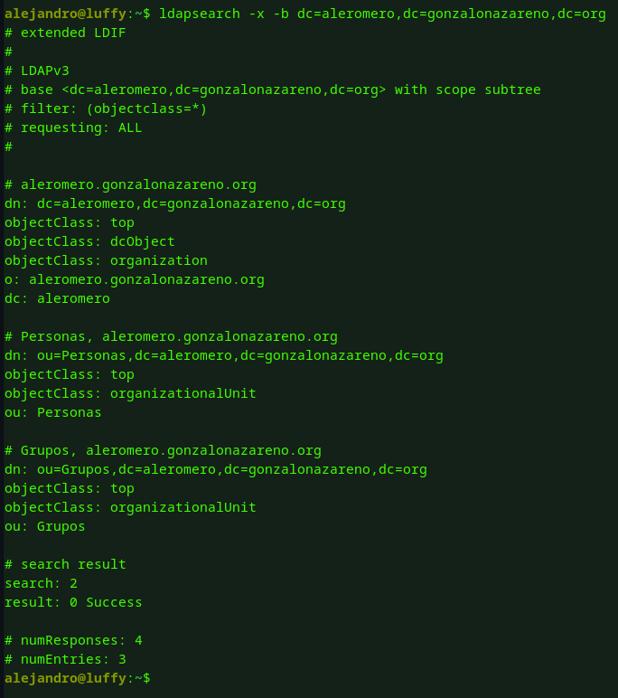
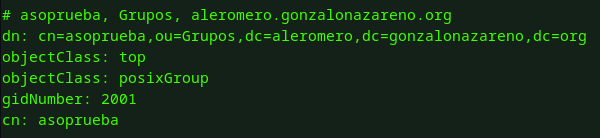
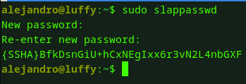
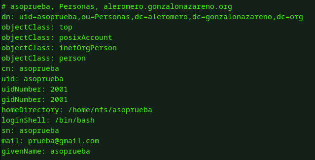
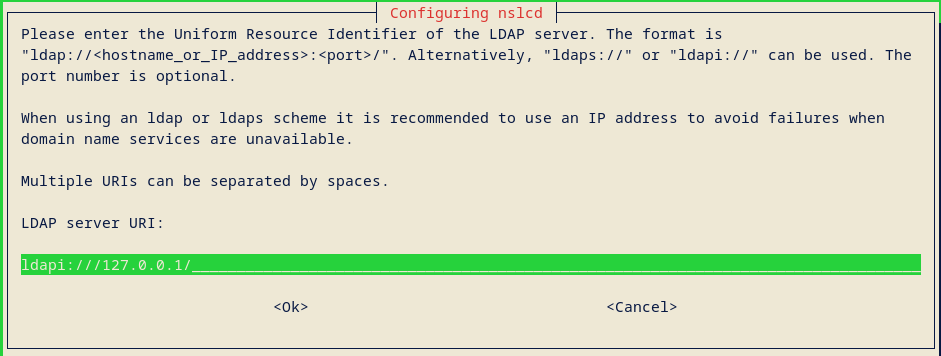
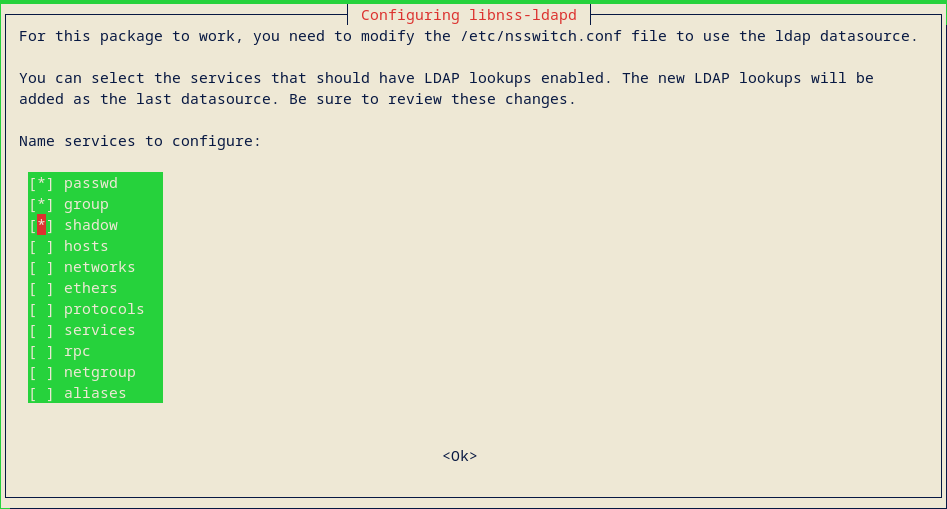

# Instalación y configuración inicial de OpenLDAP

## Enunciado

Realiza la instalación y configuración básica de OpenLDAP en una unidad de tu escenario de OpenStack, utilizando como base el nombre DNS asignado de tu proyecto. Deberás crear un usuario llamado asoprueba y configurar una máquina cliente basada en Debian y Rocky para que pueda validarse en servidor ldap configurado anteriormente con el usuario asoprueba. La ubicación del los home de los diferentes usuarios estarán ubicados en un servidor nfs.

---

## Introducción

En esta actividad, realizaremos la instalación y configuración inicial de OpenLDAP en una máquina de nuestro entorno OpenStack, utilizando el nombre DNS asignado al proyecto. OpenLDAP es una herramienta ampliamente empleada para la administración centralizada de usuarios y permisos en sistemas corporativos.

El propósito principal es poner en marcha un servidor LDAP completamente operativo y asegurarnos de que un sistema Debian y otro con base Rocky puedan realizar autenticaciones usando el usuario asoprueba. Para conservar los datos de los usuarios y asegurar su disponibilidad, sus directorios personales estarán ubicados en un servidor NFS.

Durante el desarrollo de la práctica, se tratarán los siguientes aspectos:

    Instalación y puesta en marcha de OpenLDAP en un servidor.

    Creación del usuario asoprueba en el entorno LDAP.

    Configuración de clientes Debian y Rocky para que autentiquen mediante LDAP.

    Uso de un servidor NFS para alojar los directorios personales de los usuarios.

Esta práctica brinda una comprensión sólida de cómo funciona la autenticación centralizada con LDAP, y muestra cómo integrarla con servicios complementarios como NFS para facilitar la gestión de usuarios en entornos distribuidos.

---

## Implementación

### Servidor OpenLDAP

La máquina encargada de desempeñar el rol de servidor OpenLDAP será luffy. Para obtener su FQDN, emplearemos el siguiente comando:

```
alejandro@luffy:~$ hostname -f
luffy.aleromero.gonzalonazareno.org
```

Instalamos OpenLDAP con el siguiente comando:

```
alejandro@luffy:~$ sudo apt install slapd
Reading package lists... Done
Building dependency tree... Done
Reading state information... Done
The following additional packages will be installed:
```

Durante el proceso de instalación, se solicitará una contraseña para el usuario administrador del servicio:



Tras completar la instalación, podemos verificar que el puerto TCP 389 está abierto, ya que es el encargado de recibir las solicitudes al servicio.

```
alejandro@luffy:~$ sudo netstat -tlnp | egrep slap
```



Tras esto, instalaremos el paquete de herramientas que utilizará OpenLDAP:

```
alejandro@luffy:~$ sudo apt install ldap-utils
Reading package lists... Done
Building dependency tree... Done
Reading state information... Done
```

A partir de este momento, es posible utilizar el comando ldapsearch junto con las credenciales configuradas durante la instalación para consultar la información almacenada en nuestro directorio.

```
ldapsearch -x -D "cn=admin,dc=aleromero,dc=gonzalonazareno,dc=org" -b "dc=aleromero,dc=gonzalonazareno,dc=org" -W
```



Con el fin de mantener una mejor organización de los objetos que vamos a definir, generaremos un nuevo archivo que contendrá la siguiente información:

```
alejandro@luffy:~$ cat UnidadesOrganizativas.ldif 
dn: ou=Personas,dc=aleromero,dc=gonzalonazareno,dc=org
objectClass: top
objectClass: organizationalUnit
ou: Personas

dn: ou=Grupos,dc=aleromero,dc=gonzalonazareno,dc=org
objectClass: top
objectClass: organizationalUnit
ou: Grupos
```

Una vez creado este archivo, lo incorporaremos al directorio utilizando el siguiente comando:

```
ldapadd -x -D "cn=admin,dc=aleromero,dc=gonzalonazareno,dc=org" -f UnidadesOrganizativas.ldif -W
```

Utilizamos nuevamente el comando ldapsearch para verificar que los cambios se hayan aplicado correctamente.

```
ldapsearch -x -b dc=aleromero,dc=gonzalonazareno,dc=org
```




Ademas, crearemos un grupo llamado asoprueba

```
alejandro@luffy:~$ cat grupos.ldif 
dn: cn=asoprueba,ou=Grupos,dc=aleromero,dc=gonzalonazareno,dc=org
objectClass: top
objectClass: posixGroup
gidNumber: 2001
cn: asoprueba
```

Lo añadimos a nuestro directorio:

```
ldapadd -x -D 'cn=admin,dc=aleromero,dc=gonzalonazareno,dc=org' -W -f grupos.ldif
```

Comprobamos que se han efectuado los cambios:

```
ldapsearch -x -b dc=aleromero,dc=gonzalonazareno,dc=org
```



Creamos una contraseña cifrada para nuestro usuario asoprueba con el comando slappasswd:



Creamos el usuario asoprueba

```
alejandro@luffy:~$ cat usuarios.ldif 
dn: uid=asoprueba,ou=Personas,dc=aleromero,dc=gonzalonazareno,dc=org
objectClass: top
objectClass: posixAccount
objectClass: inetOrgPerson
objectClass: person
cn: asoprueba
uid: asoprueba
uidNumber: 2001
gidNumber: 2001
homeDirectory: /home/nfs/asoprueba
loginShell: /bin/bash
userPassword: {SSHA}L/agZ+tPgjTLCdldyORqGgZjRj2tsNrw
sn: asoprueba
mail: prueba@gmail.com
givenName: asoprueba
```

Añadimos el usuario a nuestro directorio:

```
ldapadd -x -D 'cn=admin,dc=aleromero,dc=gonzalonazareno,dc=org' -W -f usuarios.ldif
```

Comprobamos que se ha añadido correctamente:



El usuario asoprueba no podrá acceder a su cuenta, ya que no tiene un directorio de inicio. Para crearlo, ejecutaremos el siguiente comando:

```
alejandro@luffy:~$ sudo mkdir /home/nfs
alejandro@luffy:~$ sudo mkdir /home/nfs/asoprueba
alejandro@luffy:~$ sudo chown 2001:2001 /home/nfs/asoprueba
```

Tras esto, modificaremos el fichero /etc/exports para que el usuario asoprueba pueda acceder a su directorio de inicio; añadiendo lo siguiente:

```
/home/nfs       *(rw,fsid=0,subtree_check)
```

Además, crearemos un directorio para pruebas posteriores:

```
mkdir prueba-servidor
```

Reiniciamos el servicio para aplicar los cambios:

```
alejandro@luffy:~$ sudo /etc/init.d/nfs-kernel-server restart
Restarting nfs-kernel-server (via systemctl): nfs-kernel-server.service.
```

En el servidor LDAP, procedemos a instalar los paquetes necesarios para que el sistema pueda resolver nombres de usuarios (UID), grupos (GID), consultar datos en un directorio LDAP, autenticarse y almacenar en caché dicha información.

```
apt-get install libpam-ldapd libpam-ldap nscd libnss-ldap
```

En la instalación, se nos pedirá una dirección ip, en este caso, usaremos la local:



Indicamos las credenciales que hemos estado usando hasta ahora:


En este paso marcamos las opciones necesarias para que el sistema pueda autenticar usuarios desde el directorio LDAP:

