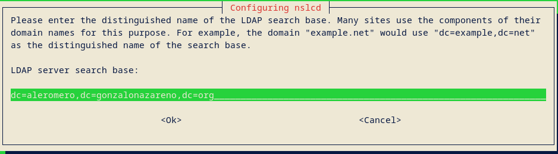
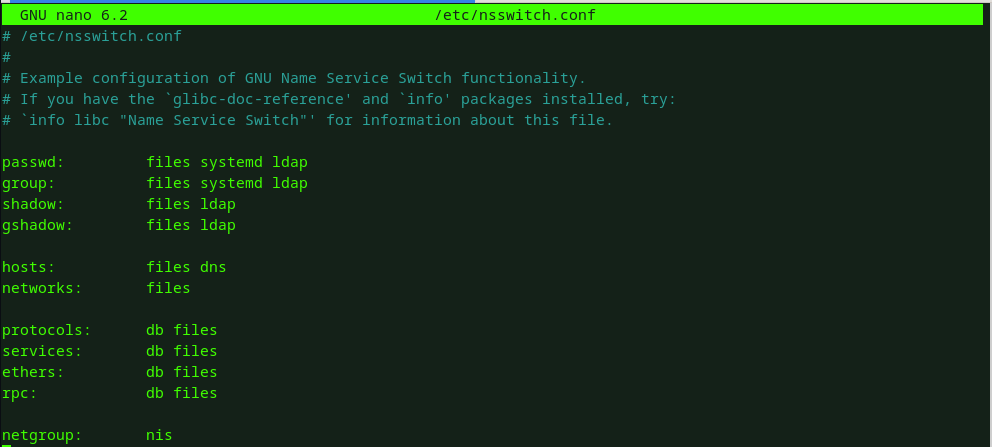

# Instalación y configuración inicial de OpenLDAP

## Enunciado

Realiza la instalación y configuración básica de OpenLDAP en una unidad de tu escenario de OpenStack, utilizando como base el nombre DNS asignado de tu proyecto. Deberás crear un usuario llamado asoprueba y configurar una máquina cliente basada en Debian y Rocky para que pueda validarse en servidor ldap configurado anteriormente con el usuario asoprueba. La ubicación del los home de los diferentes usuarios estarán ubicados en un servidor nfs.

---

## Introducción

En esta actividad, realizaremos la instalación y configuración inicial de OpenLDAP en una máquina de nuestro entorno OpenStack, utilizando el nombre DNS asignado al proyecto. OpenLDAP es una herramienta ampliamente empleada para la administración centralizada de usuarios y permisos en sistemas corporativos.

El propósito principal es poner en marcha un servidor LDAP completamente operativo y asegurarnos de que un sistema Debian y otro con base Rocky puedan realizar autenticaciones usando el usuario asoprueba. Para conservar los datos de los usuarios y asegurar su disponibilidad, sus directorios personales estarán ubicados en un servidor NFS.

Durante el desarrollo de la práctica, se tratarán los siguientes aspectos:

    Instalación y puesta en marcha de OpenLDAP en un servidor.

    Creación del usuario asoprueba en el entorno LDAP.

    Configuración de clientes Debian y Rocky para que autentiquen mediante LDAP.

    Uso de un servidor NFS para alojar los directorios personales de los usuarios.

Esta práctica brinda una comprensión sólida de cómo funciona la autenticación centralizada con LDAP, y muestra cómo integrarla con servicios complementarios como NFS para facilitar la gestión de usuarios en entornos distribuidos.

---

## Implementación

### Servidor OpenLDAP

La máquina encargada de desempeñar el rol de servidor OpenLDAP será luffy. Para obtener su FQDN, emplearemos el siguiente comando:

```
alejandro@luffy:~$ hostname -f
luffy.aleromero.gonzalonazareno.org
```

Instalamos OpenLDAP con el siguiente comando:

```
alejandro@luffy:~$ sudo apt install slapd
Reading package lists... Done
Building dependency tree... Done
Reading state information... Done
The following additional packages will be installed:
```

Durante el proceso de instalación, se solicitará una contraseña para el usuario administrador del servicio:


Tras completar la instalación, podemos verificar que el puerto TCP 389 está abierto, ya que es el encargado de recibir las solicitudes al servicio.

```
alejandro@luffy:~$ sudo netstat -tlnp | egrep slap
```


Tras esto, instalaremos el paquete de herramientas que utilizará OpenLDAP:

```
alejandro@luffy:~$ sudo apt install ldap-utils
Reading package lists... Done
Building dependency tree... Done
Reading state information... Done
```

A partir de este momento, es posible utilizar el comando ldapsearch junto con las credenciales configuradas durante la instalación para consultar la información almacenada en nuestro directorio.

```
ldapsearch -x -D "cn=admin,dc=aleromero,dc=gonzalonazareno,dc=org" -b "dc=aleromero,dc=gonzalonazareno,dc=org" -W
```


Con el fin de mantener una mejor organización de los objetos que vamos a definir, generaremos un nuevo archivo que contendrá la siguiente información:

```
alejandro@luffy:~$ cat UnidadesOrganizativas.ldif 
dn: ou=Personas,dc=aleromero,dc=gonzalonazareno,dc=org
objectClass: top
objectClass: organizationalUnit
ou: Personas

dn: ou=Grupos,dc=aleromero,dc=gonzalonazareno,dc=org
objectClass: top
objectClass: organizationalUnit
ou: Grupos
```

Una vez creado este archivo, lo incorporaremos al directorio utilizando el siguiente comando:

```
ldapadd -x -D "cn=admin,dc=aleromero,dc=gonzalonazareno,dc=org" -f UnidadesOrganizativas.ldif -W
```

Utilizamos nuevamente el comando ldapsearch para verificar que los cambios se hayan aplicado correctamente.

```
ldapsearch -x -b dc=aleromero,dc=gonzalonazareno,dc=org
```


Ademas, crearemos un grupo llamado asoprueba

```
alejandro@luffy:~$ cat grupos.ldif 
dn: cn=asoprueba,ou=Grupos,dc=aleromero,dc=gonzalonazareno,dc=org
objectClass: top
objectClass: posixGroup
gidNumber: 2001
cn: asoprueba
```

Lo añadimos a nuestro directorio:

```
ldapadd -x -D 'cn=admin,dc=aleromero,dc=gonzalonazareno,dc=org' -W -f grupos.ldif
```

Comprobamos que se han efectuado los cambios:

```
ldapsearch -x -b dc=aleromero,dc=gonzalonazareno,dc=org
```


Creamos una contraseña cifrada para nuestro usuario asoprueba con el comando slappasswd:


Creamos el usuario asoprueba

```
alejandro@luffy:~$ cat usuarios.ldif 
dn: uid=asoprueba,ou=Personas,dc=aleromero,dc=gonzalonazareno,dc=org
objectClass: top
objectClass: posixAccount
objectClass: inetOrgPerson
objectClass: person
cn: asoprueba
uid: asoprueba
uidNumber: 2001
gidNumber: 2001
homeDirectory: /home/nfs/asoprueba
loginShell: /bin/bash
userPassword: {SSHA}L/agZ+tPgjTLCdldyORqGgZjRj2tsNrw
sn: asoprueba
mail: prueba@gmail.com
givenName: asoprueba
```

Añadimos el usuario a nuestro directorio:

```
ldapadd -x -D 'cn=admin,dc=aleromero,dc=gonzalonazareno,dc=org' -W -f usuarios.ldif
```

Comprobamos que se ha añadido correctamente:


El usuario asoprueba no podrá acceder a su cuenta, ya que no tiene un directorio de inicio. Para crearlo, ejecutaremos el siguiente comando:

```
alejandro@luffy:~$ sudo mkdir /home/nfs
alejandro@luffy:~$ sudo mkdir /home/nfs/asoprueba
alejandro@luffy:~$ sudo chown 2001:2001 /home/nfs/asoprueba
```

Tras esto, modificaremos el fichero /etc/exports para que el usuario asoprueba pueda acceder a su directorio de inicio; añadiendo lo siguiente:

```
/home/nfs       *(rw,fsid=0,subtree_check)
```

Además, crearemos un directorio para pruebas posteriores:

```
mkdir prueba-servidor
```

Reiniciamos el servicio para aplicar los cambios:

```
alejandro@luffy:~$ sudo /etc/init.d/nfs-kernel-server restart
Restarting nfs-kernel-server (via systemctl): nfs-kernel-server.service.
```

En el servidor LDAP, procedemos a instalar los paquetes necesarios para que el sistema pueda resolver nombres de usuarios (UID), grupos (GID), consultar datos en un directorio LDAP, autenticarse y almacenar en caché dicha información.

```
apt-get install libpam-ldapd libpam-ldap nscd libnss-ldap
```

En la instalación, se nos pedirá una dirección ip, en este caso, usaremos la local:


Indicamos las credenciales que hemos estado usando hasta ahora:



En este paso marcamos las opciones necesarias para que el sistema pueda autenticar usuarios desde el directorio LDAP:


Modificamos el fichero /etc/nsswitch.conf para que el sistema utilice el servicio LDAP:


Comprobamos el uuid del usuario asoprueba con el siguiente comando:

```
id asoprueba
```


Y para terminar, nos logueamos con el usuario asoprueba


### Configuración del Cliente Ubuntu

Para configurar un cliente Ubuntu, utilizaremos la máquina sanji; primero, debemos instalar el paquete de herramientas de ldap:

```
apt install ldap-utils
```

Configuramos el fichero de configuración del cliente, añadiendo las últimas 2 líneas:

```
aleromero@sanji:~$ cat /etc/ldap/ldap.conf
#
# LDAP Defaults
#

# See ldap.conf(5) for details
# This file should be world readable but not world writable.

#BASE	dc=example,dc=com
#URI	ldap://ldap.example.com ldap://ldap-provider.example.com:666

#SIZELIMIT	12
#TIMELIMIT	15
#DEREF		never

# TLS certificates (needed for GnuTLS)
TLS_CACERT	/etc/ssl/certs/ca-certificates.crt

BASE dc=aleromero,dc=gonzalonazareno,dc=org
URI ldap://luffy.aleromero.gonzalonazareno.org
```

Tras esto, probamos que funciona correctamente con el siguiente comando:

```
ldapsearch -x -b dc=alejandrolf,dc=gonzalonazareno,dc=org
```


Además, probamos la conexión con el usuario asoprueba:

```
ldapwhoami -x -D "uid=asoprueba,ou=Personas,dc=aleromero,dc=gonzalonazareno,dc=org" -W
```


Instalaremos los siguientes paquetes necesarios:
```
sudo apt install -y libnss-ldapd libpam-ldapd nslcd nscd
```

En la siguiente ventana que nos aparecerá, indicamos la dirección ya usada:


Modificamos el fichero /etc/nsswitch.conf para que el sistema utilice el servicio LDAP para la resolución de nombres:



Reiniciamos el servicio nscd para poder acceder al servidor con el comando login:

```
sudo service nscd restart
```

Para montar la carpeta de inicio del usuario asoprueba, instalaremos el paquete para usar NFS como cliente:

```
sudo apt install -y nfs-common
```

Activamos el servicio:

```
sudo systemctl start nfs-client.target & sudo systemctl enable nfs-client.target

```

Creamos el directorio de montaje:

```
sudo mkdir /home/nfs
sudo mkdir /home/nfs/asoprueba
sudo chown 2001:2001 /home/nfs/asoprueba
```

Cargamos el módulo de NFS con el siguiente módulo:

```
root@sanji:~# echo NFS | tee -a /etc/modules
NFS
```

Creamos una unidad systemd para montar el directorio con NFS:

```
root@sanji:~# cat /etc/systemd/system/home-nfs.mount
[Unit]
Description=Montaje NFS
Requires=network-online.target
After=network-online.target
[Mount]
What=192.168.0.1:/home/nfs
Where=/home/nfs
Options=_netdev,auto
Type=nfs
[Install]
WantedBy=multi-user.target
```

Comprobamos que funciona correctamente:


Usamos el comando df -h para comprobar que se ha montado correctamente:


Probamos a conectarnos con el usuario asoprueba:


Como vemos, aparece el directorio que creamos dentro del directorio de inicio del usuario; para terminar con las comprobaciones, crearemos un fichero de texto:


Nos vamos a luffy y comprobamos que el fichero de texto creado en sanji se encuentra en el directorio:


### Configuración del Cliente Rocky

Para configurar un cliente Rocky, utilizaremos la máquina zoro; comenzaremos instalando el paquete openldap-clients para poder conectarnos al servidor LDAP y comprobar que todo funciona correctamente.

```
sudo dnf install openldap-clients sssd sssd-ldap oddjob-mkhomedir sssd-tools -y
```

Editaremos el fichero /etc/pam.d/system-auth añadiendo la siguiente línea:


Creamos un fichero llamado /etc/openldap/ldap.conf con el siguiente contenido para que el cliente pueda conectarse al servidor LDAP:

```
BASE dc=aleromero,dc=gonzalonazareno,dc=org
URI ldap://luffy.aleromero.gonzalonazareno.org
```

Para que el usuario asoprueba pueda conectarse al servidor LDAP, tenemos que editar /etc/pam.d/system-auth y añadir la siguiente línea:

```
session required pam_mkhomedir.so skel=/etc/skel umask=0022
```


Tras esto, probamos que funciona correctamente con el siguiente comando:

```
ldapsearch -x -b dc=aleromero,dc=gonzalonazareno,dc=org
```


Además, probamos la conexión con el usuario asoprueba:

```
ldapwhoami -x -D "uid=asoprueba,ou=Personas,dc=aleromero,dc=gonzalonazareno,dc=org" -W
```

Para realizar el login al servidor LDAP, instalamos sssd y sssd-ldap; además, crearemos un fichero de configuración llamado /etc/ssd/sssd.conf:

```
[alejandro@zoro ~]$ sudo cat /etc/sssd/sssd.conf
[domain/default]
id_provider = ldap
auth_provider = ldap
chpass_provider = ldap
autofs_provider = ldap

ldap_uri = ldap://luffy.aleromero.gonzalonazareno.org
ldap_search_base = dc=aleromero,dc=gonzalonazareno,dc=org
ldap_user_search_base = ou=Personas,dc=aleromero,dc=gonzalonazareno,dc=org
ldap_user_object_class = posixAccount

ldap_id_use_start_tls = False
# O usa esta línea si prefieres SSL
# ldap_uri = ldaps://luffy.aleromero.gonzalonazareno.org

ldap_tls_reqcert = allow
ldap_tls_cacertdir = /etc/openldap/cacerts

cache_credentials = True

[sssd]
services = nss, pam, autofs
domains = default

[nss]
homedir_substring = /home/nfs
```

Le cambiamos los permisos al fichero /etc/sssd/sssd.conf; habilitamos el servicio y lo reiniciamos:

```
[alejandro@zoro ~]$ sudo chmod 600 /etc/sssd/sssd.conf
[alejandro@zoro ~]$ sudo systemctl restart sssd
[alejandro@zoro ~]$ sudo systemctl enable sssd
```

Creamos el directorio /home/nfs y lo hacemos propietario del usuario asoprueba:

```
[alejandro@zoro ~]$ sudo mkdir /home/nfs
[alejandro@zoro ~]$ sudo mkdir /home/nfs/asoprueba
[alejandro@zoro ~]$ sudo chown 2001:2001 /home/nfs/asoprueba
```

Creamos una unidad systemd para realizar el montaje mediante NFS:

```
[alejandro@zoro ~]$ sudo cat /etc/systemd/system/home-nfs.mount
[Unit]
Description=Montaje NFS
Requires=NetworkManager.service
After=NetworkManager.service
[Mount]
What=172.16.0.72:/home/nfs
Where=/home/nfs
Options=_netdev,auto
Type=nfs
[Install]
WantedBy=multi-user.target
```

Activamos el servicio correspondiente:

```
[alejandro@zoro ~]$ sudo systemctl daemon-reload
[alejandro@zoro ~]$ sudo systemctl start home-nfs.mount
[alejandro@zoro ~]$ sudo systemctl enable home-nfs.mount
Created symlink /etc/systemd/system/multi-user.target.wants/home-nfs.mount → /etc/systemd/system/home-nfs.mount.
```

Comprobamos que el directorio se ha montado correctamente con el comando df -h:


Accedemos al directorio de montaje y comprobamos que, podemos ver los ficheros de prueba, creados anteriormente, desde el resto de máquinas:


